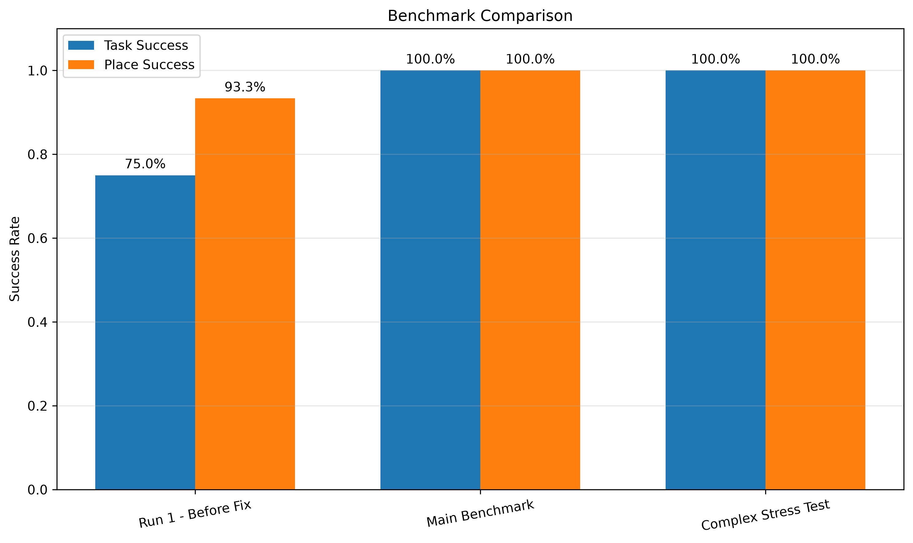
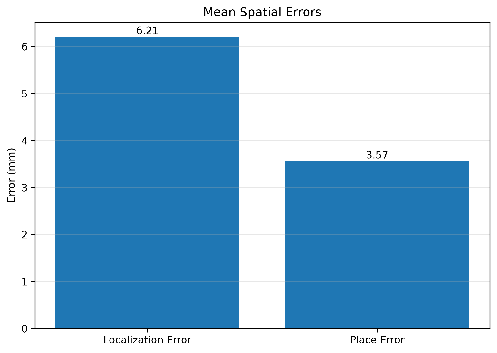
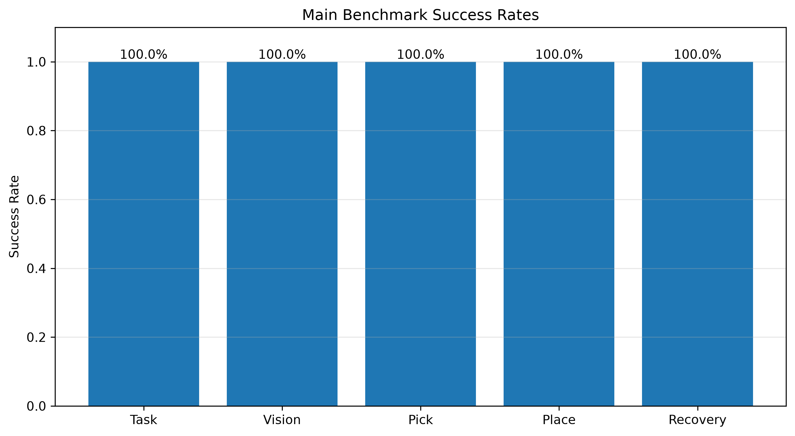

# Vision-Grounded Embodied Task Agent

Language-guided visual manipulation, state management, recovery, and independent evaluation for a Franka Panda robot in MuJoCo.

[English](#english) | [中文](#中文)

## English

### 1. Overview

Vision-Grounded Embodied Task Agent is a V1 research project for language-guided tabletop manipulation in a tested single-object MuJoCo workspace. Given an instruction such as “pick up the green cube” or “move the green cube to the right,” the system uses Qwen for task understanding and high-level action planning, RGB-D vision for action-time object localization, and Franka Panda Pick / Place skills for execution.

Qwen does not generate joint positions, velocities, accelerations, torques, or other joint-level robot commands. Low-level motion is handled by the robot motion layer.

The project includes:

- Natural-language task understanding
- Qwen high-level planning with structured JSON actions
- RGB-D visual perception
- Language-guided segmentation with Florence-2
- Depth and point-cloud-based 3D grasp localization
- Action constraints through ActionGuard
- Pick / Place skills
- State management and failure recovery
- Independent MuJoCo ground-truth evaluation
- Automated benchmark recording and visualization

The project evolved from an early sequential prototype:

~~~text
Language → Qwen → Pick / Place → Robot
~~~

The V1 system has an explicit Runtime / Evaluation boundary.

### 2. Runtime Architecture

~~~text
Natural Language
      ↓
Qwen Planner
      ↓
ActionGuard
      ↓
RGB-D Vision
      ↓
Pick / Place Skills
      ↓
Robot Execution
      ↓
State Management / Recovery
~~~

The Planner is responsible only for task understanding and high-level action selection. It emits structured actions:

~~~json
{
  "action": "pick | place | finish",
  "target": "left | center | right | null"
}
~~~

ActionGuard checks action validity against the Agent’s internal state before execution. For Pick, the grasp position is produced by:

~~~text
MuJoCo RGB-D Camera
        ↓
Florence-2 Segmentation
        ↓
Object Mask
        ↓
Depth Filtering
        ↓
Point Cloud
        ↓
3D Grasp Position
~~~

Runtime does not receive a benchmark task type, hidden target answer, expected action, or object ground-truth position. Fixed left / center / right coordinates are calibrated workspace regions, not dynamically read object positions.

Ground truth is evaluation-only:

~~~text
Robot Execution ──→ Runtime State / Recovery
        │
        └─────────→ MuJoCo Ground Truth → GTEvaluator → Metrics / Records only
~~~

Evaluation results do not update the Planner, ActionGuard, StateManager, RecoveryPolicy, or robot control.

### 3. Capabilities and Scope

The current project focuses on:

1. Vision-grounded manipulation
2. Structured scene and robot state
3. Skill-based robot control
4. Runtime / Evaluation isolation
5. Failure diagnosis and recovery
6. Step-by-step task execution
7. Quantitative evaluation

The V1 scope is deliberately limited to a single green cube in a calibrated MuJoCo workspace. It is not a general-purpose embodied intelligence system and does not claim real-world robot performance.

### 4. Franka Panda Control and Motion

The project includes Franka Panda control and state experiments involving:

- Joint position and velocity
- TCP pose
- Object and goal pose inspection
- Joint-space control
- Basic PD control experiments
- Robot stopping and velocity decay
- TCP-to-object spatial relationships

These experiments establish the distinction:

~~~text
Observation ≠ Action
Joint State ≠ Cartesian State
qpos ≠ TCP Pose
~~~

#### 4.1 Forward and Inverse Kinematics

Forward Kinematics uses MuJoCo’s forward computation:

~~~text
7-D Joint Position
        ↓
mujoco.mj_forward
        ↓
TCP Position + Orientation
~~~

Inverse Kinematics uses the MuJoCo site Jacobian and an iterative damped least-squares solver:

~~~text
Target TCP Pose
        ↓
Site Jacobian + Damped Least Squares
        ↓
7-D Joint Target
~~~

Each iteration updates the simulated kinematics and compares the calculated TCP pose with the target pose.

#### 4.2 Robot Motion Layer

The V1 motion flow is implemented in panda_qwen_agent.py:

~~~text
Target TCP Position
        ↓
solve_ik
        ↓
JointTrajectory
        ↓
move_arm_to / move_fingers
        ↓
MuJoCo Robot Execution
~~~

### 5. Evaluation Architecture

GTEvaluator reads MuJoCo state only after or alongside robot execution for independent metrics and records. It never feeds results back into Runtime.

The benchmark wrapper performs a physical episode reset and separately synchronizes the Agent belief:

~~~text
MuJoCo keyframe reset
        +
state_manager.update_holding(None)
~~~

RobotStateManager.reset_task() has different semantics: it clears task-local history and error fields but preserves the persistent holding belief during ordinary user tasks.

### 6. Results

The final V1 evaluation contains:

- Main Benchmark: 60 episodes
- Complex Language Stress Test: 30 episodes
- Total evaluated episodes: 90
- Main Benchmark Task Success: 100%
- Main Benchmark Vision Success: 100%
- Main Benchmark Pick Success: 100%
- Main Benchmark Place Success: 100%
- Complex Stress Test Task Success: 100%
- Mean 3D Localization Error: approximately 6.21 mm
- Mean Placement Error: approximately 3.57 mm

The failure-recovery cases contain deliberately injected invalid actions. Their invalid-action rate must not be interpreted as the Planner’s natural error rate. The diagnostic Run 1 is not included in the 90 final V1 episodes.

#### 6.1 Benchmark Comparison

Run 1 achieved 75% Task Success and exposed cross-episode Agent belief-state leakage: MuJoCo had been physically reset, but the Agent’s holding belief had not been synchronized. After adding episode-level physical reset plus Agent belief synchronization, the same 60-case Main Benchmark reached 100%. The subsequent 30-case Complex Language Stress Test also reached 100%.

This 75% → 100% change is a state-reset debugging result, not a model-training improvement.

#### 6.2 Spatial Evaluation Errors

For the Main Benchmark:

- Mean 3D Localization Error ≈ 6.21 mm
- Mean Placement Error ≈ 3.57 mm

The JSON records store spatial errors in meters; the figures display them in millimeters. MuJoCo ground truth is used only to calculate these independent evaluation metrics.

#### 6.3 Main Benchmark Success Rates

Task, Vision, Pick, Place, and Recovery rates are 100% in the tested single-object MuJoCo benchmark configuration. These values do not imply universal 100% success in robot manipulation and do not constitute a real-world performance claim.

#### 6.4 Metric Definitions and Limitations

- Vision Success means PerceptionSystem returned a usable structured observation. It is not a localization-accuracy threshold; localization accuracy is reported separately through 3D localization error.
- Pick Success requires a lift of at least 0.05 m from the episode’s initial box position and a box-to-gripper distance of at most 0.08 m.
- Place / Place Task Success currently checks XY position error against a 0.06 m threshold.
- Place evaluation does not provide a complete Z, orientation, long-term stability, or 6-DoF placement assessment.
- The home keyframe places the cube in the center region. A center task’s final XY check alone therefore cannot prove that manipulation occurred. All successful Place episodes in the published Main and Complex results also contain successful GT Pick and Place action records.
- Recovery Success Rate = 100% means that, in the tested failure-injection cases, the Runtime action following recovery executed successfully. It does not mean every possible failure can be recovered from.
- Main recovery episodes: 12/12 ultimately passed independent GT task evaluation.
- Complex recovery episodes: 6/6 ultimately passed independent GT task evaluation.

### 7. Running the Project

Prepare a Python 3 environment and install direct dependencies:

~~~bash
python -m pip install -r requirements.txt
~~~

requirements.txt includes MuJoCo, PyTorch, Transformers / Florence-2, an OpenAI-compatible client for Qwen, NumPy, Pillow, and Matplotlib. Versions are recorded where they were reliably known; unpinned dependencies should not be treated as an exact environment lock.

Configure Qwen credentials through environment variables or a local .env file:

~~~dotenv
DASHSCOPE_API_KEY=your_api_key_here
base_url=your_compatible_api_base_url
~~~

Never commit an API key or local .env file.

Run the interactive Agent from the repository root:

~~~bash
python panda_qwen_agent.py
~~~

Run the 60-episode Main Benchmark:

~~~bash
python run_benchmark.py --suite main
~~~

Run the 30-episode Complex Language Stress Test:

~~~bash
python run_benchmark.py --suite complex
~~~

New runs are written to results/benchmark_main_latest.json or results/benchmark_complex_latest.json and do not overwrite the three formal release result files.

Generate figures from the formal results:

~~~bash
python evaluation/plot_results.py
~~~

Running the Agent or benchmark requires Qwen API access. Florence-2 may require a model download on first use. qwen-plus is a remote service model name, so its exact service version cannot be fully locked by this repository.

### 8. License

The root [MIT License](LICENSE) applies to the project’s original code.

Third-party assets notice: models and resources under franka_panda/ remain governed by the original license included in that directory. The root MIT License does not replace or modify those third-party license terms.

---

## 中文

### 1. 项目概述

Vision-Grounded Embodied Task Agent 是一个面向语言引导桌面操作的 V1 研究项目，测试范围为单物体 MuJoCo 工作空间。对于“抓起绿色方块”或“把绿色方块移动到右侧”等指令，系统使用 Qwen 完成任务理解与高层动作规划，使用 RGB-D 视觉进行动作时目标定位，并通过 Franka Panda 的 Pick / Place 技能执行任务。

Qwen 不直接生成关节位置、速度、加速度、力矩或其他 joint-level robot control 指令。底层运动由机器人运动层负责。

项目包括：

- 自然语言任务理解
- Qwen 高层规划与结构化 JSON 动作
- RGB-D 视觉感知
- Florence-2 语言引导分割
- 基于深度与点云（Point Cloud）的三维抓取定位
- 动作约束（ActionGuard）
- Pick / Place 技能
- 状态管理（State Management）与失败恢复（Failure Recovery）
- 独立 MuJoCo 真值评估（Ground-Truth Evaluation）
- 自动 Benchmark 记录与可视化

项目从早期顺序式原型演进而来：

~~~text
Language → Qwen → Pick / Place → Robot
~~~

V1 系统明确区分 Runtime 与 Evaluation。

### 2. Runtime 架构

~~~text
自然语言
   ↓
Qwen Planner
   ↓
ActionGuard
   ↓
RGB-D Vision
   ↓
Pick / Place Skills
   ↓
Robot Execution
   ↓
State Management / Recovery
~~~

Planner 只负责任务理解与高层动作选择，并输出结构化动作：

~~~json
{
  "action": "pick | place | finish",
  "target": "left | center | right | null"
}
~~~

ActionGuard 在执行前根据 Agent 内部状态检查动作是否合法。对于 Pick，抓取位置来自以下视觉管线：

~~~text
MuJoCo RGB-D Camera
        ↓
Florence-2 Segmentation
        ↓
Object Mask
        ↓
Depth Filtering
        ↓
Point Cloud
        ↓
3D Grasp Position
~~~

Runtime 不接收 benchmark task type、隐藏目标答案、期望动作或物体 Ground Truth 位置。left / center / right 坐标是预先标定的固定工作空间区域，不是运行时动态读取的物体位置。

Ground Truth 仅用于评估：

~~~text
Robot Execution ──→ Runtime State / Recovery
        │
        └─────────→ MuJoCo Ground Truth → GTEvaluator → Metrics / Records only
~~~

Evaluation 结果不会反馈给 Planner、ActionGuard、StateManager、RecoveryPolicy 或机器人控制。

### 3. 能力与范围

当前项目重点包括：

1. 视觉定位操作（Vision-Grounded Manipulation）
2. 结构化场景与机器人状态
3. 基于技能的机器人控制
4. Runtime / Evaluation 隔离
5. 失败诊断与恢复
6. 分步骤任务执行
7. 定量评估

V1 的范围有意限定为标定 MuJoCo 工作空间中的单个绿色方块。它不是 general-purpose embodied intelligence 系统，也不声称具备真实机器人性能。

### 4. Franka Panda 控制与运动

项目包含 Franka Panda 控制与状态实验，涉及：

- 关节位置与速度
- TCP 位姿
- 物体与目标位姿检查
- 关节空间控制
- 基础 PD 控制实验
- 机器人停止与速度衰减
- TCP 与物体之间的空间关系

这些实验用于建立以下概念区分：

~~~text
Observation ≠ Action
Joint State ≠ Cartesian State
qpos ≠ TCP Pose
~~~

#### 4.1 正向与逆向运动学

正向运动学（Forward Kinematics）使用 MuJoCo 的正向计算：

~~~text
7-D Joint Position
        ↓
mujoco.mj_forward
        ↓
TCP Position + Orientation
~~~

逆向运动学（Inverse Kinematics）使用 MuJoCo site Jacobian 与迭代式阻尼最小二乘求解：

~~~text
Target TCP Pose
        ↓
Site Jacobian + Damped Least Squares
        ↓
7-D Joint Target
~~~

每轮迭代都会更新仿真运动学，并将计算得到的 TCP 位姿与目标位姿比较。

#### 4.2 机器人运动层

V1 的运动流程实现在 panda_qwen_agent.py 中：

~~~text
Target TCP Position
        ↓
solve_ik
        ↓
JointTrajectory
        ↓
move_arm_to / move_fingers
        ↓
MuJoCo Robot Execution
~~~

### 5. Evaluation 架构

GTEvaluator 只在机器人执行之后或执行旁路读取 MuJoCo 状态，用于独立计算指标和记录结果，绝不将结果反馈给 Runtime。

Benchmark 外层会执行物理 episode reset，并单独同步 Agent belief：

~~~text
MuJoCo keyframe reset
        +
state_manager.update_holding(None)
~~~

RobotStateManager.reset_task() 的语义不同：它会清理 task-local history 和 error 字段，但在普通用户任务之间保留持续存在的 holding belief。

### 6. 实验结果

V1 最终评测包括：

- Main Benchmark：60 episodes
- Complex Language Stress Test：30 episodes
- 总评测数量：90 episodes
- Main Benchmark Task Success：100%
- Main Benchmark Vision Success：100%
- Main Benchmark Pick Success：100%
- Main Benchmark Place Success：100%
- Complex Stress Test Task Success：100%
- Mean 3D Localization Error：约 6.21 mm
- Mean Placement Error：约 3.57 mm

Failure Recovery cases 包含人为注入的 invalid actions，其 invalid-action rate 不能解释为 Planner 的自然错误率。诊断用 Run 1 不计入最终 90 个 V1 episodes。

#### 6.1 Benchmark 对比

第一次 Run 1 的 Task Success 为 75%，并暴露出跨 episode 的 Agent belief state leakage：MuJoCo 环境已经完成物理 reset，但 Agent 的 holding belief 没有同步 reset。加入 episode-level physical reset 与 Agent belief synchronization 后，相同的 60-case Main Benchmark 达到 100%；随后进行的 30-case Complex Language Stress Test 也达到 100%。

75% → 100% 是状态 reset 问题的调试结果，不是模型训练性能提升。

#### 6.2 空间误差

Main Benchmark 的结果为：

- Mean 3D Localization Error ≈ 6.21 mm
- Mean Placement Error ≈ 3.57 mm

JSON records 中的空间误差单位为米，图中转换为毫米。MuJoCo Ground Truth 只用于计算这些独立 Evaluation 指标。

#### 6.3 Main Benchmark 成功率

Task、Vision、Pick、Place 和 Recovery 在 tested single-object MuJoCo benchmark configuration 下均为 100%。这些数值不表示机器人操作任务具有普遍 100% 成功率，也不构成真实机器人性能声明。

#### 6.4 指标定义与限制

- Vision Success 表示 PerceptionSystem 成功返回可用的结构化 observation。它不是 localization accuracy threshold；定位精度由独立的 3D localization error 衡量。
- Pick Success 要求方块相对 episode 初始位置至少抬升 0.05 m，并且方块与夹爪的距离不超过 0.08 m。
- Place / Place Task Success 当前主要检查 XY position error，threshold = 0.06 m。
- Place Evaluation 不构成完整的 Z、orientation、long-term stability 或 6-DoF placement evaluation。
- Home keyframe 中方块初始位置位于 center region，因此仅凭 center task 的最终 XY 判定不能证明机器人实际完成了搬运。正式发布的 Main / Complex 成功 Place episodes 均同时包含成功的 GT Pick 和 Place action records。
- Recovery Success Rate = 100% 仅表示在当前测试的 failure-injection cases 中，Recovery 之后的下一次 Runtime action 成功执行；它不表示任何可能的故障都能被恢复。
- Main recovery episodes：12/12 最终通过独立 GT task evaluation。
- Complex recovery episodes：6/6 最终通过独立 GT task evaluation。

### 7. 运行项目

准备 Python 3 环境并安装直接依赖：

~~~bash
python -m pip install -r requirements.txt
~~~

requirements.txt 包含 MuJoCo、PyTorch、Transformers / Florence-2、用于 Qwen 的 OpenAI-compatible client、NumPy、Pillow 和 Matplotlib。只在能够可靠确认时记录版本；未 pin 的依赖不应被理解为完整、精确的环境锁定。

通过环境变量或本地 .env 文件配置 Qwen credential：

~~~dotenv
DASHSCOPE_API_KEY=your_api_key_here
base_url=your_compatible_api_base_url
~~~

不要提交 API key 或本地 .env 文件。

从项目根目录运行交互式 Agent：

~~~bash
python panda_qwen_agent.py
~~~

运行 60-episode Main Benchmark：

~~~bash
python run_benchmark.py --suite main
~~~

运行 30-episode Complex Language Stress Test：

~~~bash
python run_benchmark.py --suite complex
~~~

新的运行结果会写入 results/benchmark_main_latest.json 或 results/benchmark_complex_latest.json，不会覆盖三份正式发布结果。

根据正式结果生成图表：

~~~bash
python evaluation/plot_results.py
~~~

运行 Agent 或 Benchmark 需要 Qwen API 访问。Florence-2 首次使用时可能需要下载模型。qwen-plus 是远程服务模型名称，因此本仓库无法完全锁定其具体服务版本。

### 8. 许可证

根目录 [MIT License](LICENSE) 适用于本项目作者自己的原创代码。

第三方资源说明（Third-party assets notice）：franka_panda/ 中的模型和资源仍遵循该目录内包含的原始许可证。根目录 MIT License 不替代、也不修改这些第三方许可条款。
