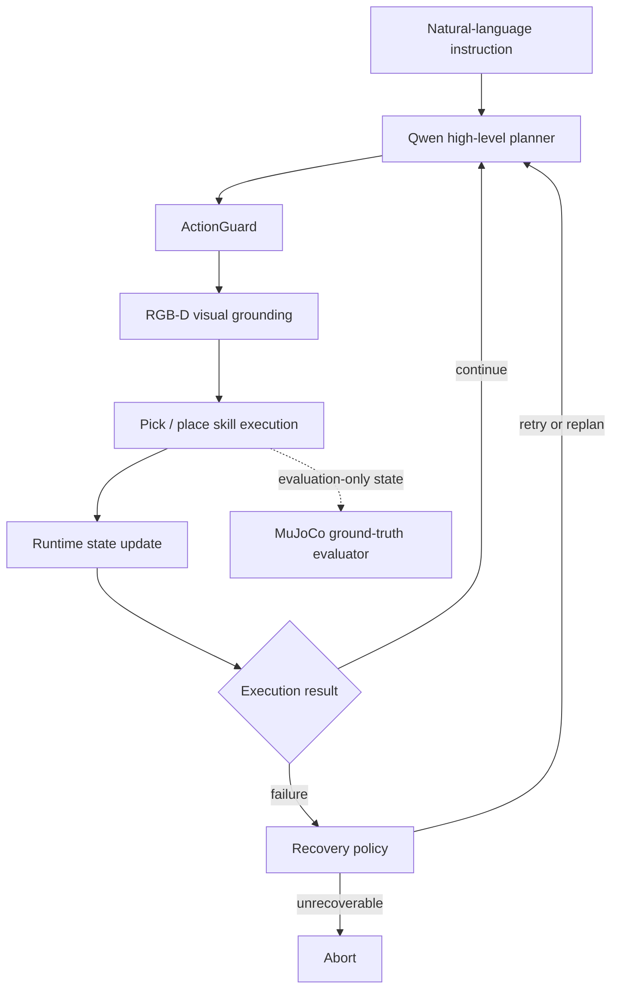

# Vision-Grounded Embodied Task Agent

Language-guided robotic manipulation in MuJoCo with RGB-D perception, high-level planning, guarded skill execution, failure recovery, and independent simulation evaluation.

## Status

**Active Development**

The current V1 is a tested single-object research prototype for a Franka Panda robot in a calibrated MuJoCo workspace. It is not a general-purpose manipulation system and does not claim real-world robot performance.

## Motivation

An embodied agent must connect language and perception to physical action while preserving a reliable boundary between what the planner requests, what the robot can execute, and what actually happened. A plausible high-level plan is not sufficient if an action violates the current robot state, visual grounding fails, or execution does not achieve the intended outcome.

This project studies that integration problem in simulation. Qwen interprets language and selects high-level actions; RGB-D perception localizes the target object; predefined Franka Panda skills execute pick and place operations; state, action guards, verification, and recovery handle the closed-loop workflow. Computer vision is used as perception for embodied action rather than as the project's primary research objective.

## System Overview



The runtime and evaluation paths are intentionally separated. The planner and recovery policy do not receive benchmark task labels, expected actions, hidden target answers, or MuJoCo ground-truth object positions.

### Visual grounding path

```text
MuJoCo RGB-D camera
    → Florence-2 language-guided segmentation
    → object mask and depth filtering
    → point-cloud reconstruction
    → 3D grasp position
```

### Robot execution path

```text
Target TCP position
    → damped-least-squares inverse kinematics
    → joint trajectory
    → arm and gripper control
    → MuJoCo execution
```

Qwen produces structured high-level actions such as `pick`, `place`, and `finish`. It does not generate joint positions, velocities, accelerations, torques, or other low-level robot commands.

## Implemented Features

- Franka Panda manipulation in MuJoCo
- Natural-language task interpretation through an OpenAI-compatible Qwen endpoint
- Structured high-level `pick`, `place`, and `finish` actions
- RGB-D capture from the active MuJoCo scene
- Florence-2 language-guided object segmentation
- Depth filtering, point-cloud reconstruction, and 3D grasp localization
- Forward kinematics and iterative damped-least-squares inverse kinematics
- Joint-trajectory arm control and gripper open/close skills
- `ActionGuard` validation against the agent's internal holding state
- Runtime state tracking for actions, targets, outcomes, errors, and history
- Bounded retry, replan, and abort decisions through `RecoveryPolicy`
- Independent MuJoCo ground-truth evaluation for pick, place, and localization
- Reproducible benchmark definitions, JSON recording, and result visualization
- Tests for current action-guard behavior

## Evaluation Snapshot

The repository contains three recorded benchmark files under `results/`:

| Run | Episodes | Task success | Mean 3D localization error | Mean placement error |
|---|---:|---:|---:|---:|
| Diagnostic run before belief-reset fix | 60 | 75% | 6.21 mm | 11.34 mm |
| Main V1 benchmark | 60 | 100% | 6.21 mm | 3.57 mm |
| Complex-language stress test | 30 | 100% | 6.21 mm | 3.58 mm |

The 75% to 100% change records a state-reset debugging result: the simulator reset between episodes, while the agent's holding belief initially remained stale. Synchronizing the physical reset and agent belief removed that benchmark leakage. It was not a model-training improvement.

These measurements apply only to the repository's tested single-green-cube MuJoCo configuration. Recovery cases use deliberately injected invalid actions, so their invalid-action rate is not a natural planner error rate. Place success currently checks XY error against a 0.06 m threshold and is not a full 6-DoF placement evaluation.


## Project Structure

```text
panda_qwen_agent.py   planner integration, robot control, and runtime loop
vision_system.py      RGB-D capture, segmentation, and 3D localization
place_regions.py      calibrated left / center / right placement targets
core/
  action_guard.py     action precondition checks
  state_manager.py    runtime belief and action history
  recovery_policy.py  retry, replan, and abort decisions
evaluation/
  gt_evaluator.py     evaluation-only MuJoCo measurements
  benchmark_recorder.py
  plot_results.py
run_benchmark.py      benchmark suites and episode reset
results/              recorded JSON results and generated figures
tests/                current deterministic tests
franka_panda/         third-party MuJoCo model assets and license
```

## How to Run

Python 3 is required. Install the direct dependencies from the repository root:

```bash
python -m venv .venv
python -m pip install -r requirements.txt
```

Configure the remote Qwen endpoint in a local `.env` file:

```dotenv
DASHSCOPE_API_KEY=your_api_key_here
base_url=your_openai_compatible_base_url
```

Do not commit `.env` or an API key. The project also loads Florence-2 through Transformers and may download model files on first use.

Run the interactive agent:

```bash
python panda_qwen_agent.py
```

Run the recorded benchmark suites:

```bash
python run_benchmark.py --suite main
python run_benchmark.py --suite complex
```

Generate the result figures:

```bash
python evaluation/plot_results.py
```

Run the current deterministic test:

```bash
python -m unittest discover -s tests
```

`requirements.txt` records direct dependencies but is not a fully reproducible environment lock. The Qwen service model is remote, and its exact service revision is not controlled by this repository.

## Example Workflow

For an instruction such as `Pick up the green cube and place it on the right`:

```text
1. Qwen returns a structured pick action.
2. ActionGuard checks that the robot is not already holding the cube.
3. RGB-D perception estimates the cube's 3D grasp position.
4. The pick skill solves IK and executes the arm and gripper trajectory.
5. Runtime state records success or an error.
6. Qwen returns a structured place action with target=right.
7. The calibrated right-region target is executed.
8. MuJoCo ground truth is read separately for benchmark metrics.
9. On a recoverable failure, RecoveryPolicy requests retry or replanning;
   repeated or motion-control failures can terminate safely.
```

This is a conceptual trace of implemented stages, not fabricated console output.

## Demo

The current repository includes benchmark figures but no committed MuJoCo video or GIF.

<!-- Add a short MuJoCo manipulation GIF or screenshot here when a representative demo has been recorded. -->

## Current Limitations

- The tested environment contains one green cube in a calibrated MuJoCo workspace.
- Place commands map `left`, `center`, and `right` to predefined coordinates; arbitrary language-specified direction and distance are not supported.
- Motion primitives do not yet accept commands such as `move up 10 cm` or `move left 5 cm`.
- Vision success currently means that perception returned a usable structured observation; localization accuracy is reported separately.
- Place evaluation checks XY distance only and does not fully assess Z, orientation, long-term stability, or 6-DoF placement quality.
- The current robot skills and controller are simulation-specific.
- ROS2 integration has not been implemented.
- Evaluation is simulation-based; no real-robot transfer result is reported.
- Recovery has been tested in defined failure-injection cases but still requires broader and more systematic evaluation.
- The main runtime remains concentrated in `panda_qwen_agent.py`, which limits modularity as the system grows.

## Roadmap

- [ ] Parse motion direction, distance, and units from language instructions
- [ ] Replace fixed displacement choices with parameterized robot-motion requests
- [ ] Convert parsed motion parameters into controller targets
- [ ] Verify that the robot moved approximately the requested distance
- [ ] Add ROS2 node-based integration
  - simulation or robot-state node
  - perception node
  - task-planning node
  - motion-execution node
- [ ] Improve failure detection and recovery coverage
- [ ] Add systematic failure-injection experiments and recovery metrics
- [ ] Expand beyond the current single-object workspace
- [ ] Evaluate transfer assumptions before claiming real-robot capability

These items describe planned work and are not part of the current implementation.

## Research Direction

The ongoing direction is reliable embodied manipulation organized around a closed loop:

```text
Observe → Plan → Act → Verify → Recover
```

The project is a platform for studying that direction, not a claim that the general problem has been solved.

## My Work

This repository documents my ongoing work on system integration, experimentation, and development of a language-guided robotic manipulation pipeline. It includes the connection between language planning, visual grounding, robot skills, runtime state, recovery behavior, and simulation evaluation represented in the current source and recorded results.

## License

The project's original code is available under the root [MIT License](LICENSE). Franka Panda model assets under `franka_panda/` retain the third-party license included in that directory.
